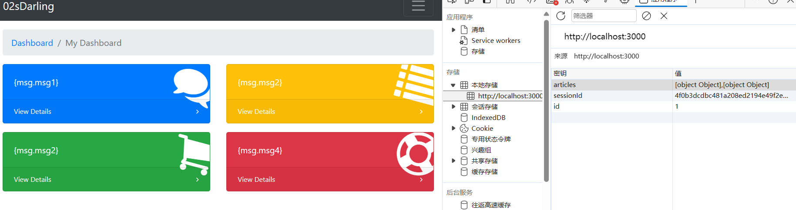
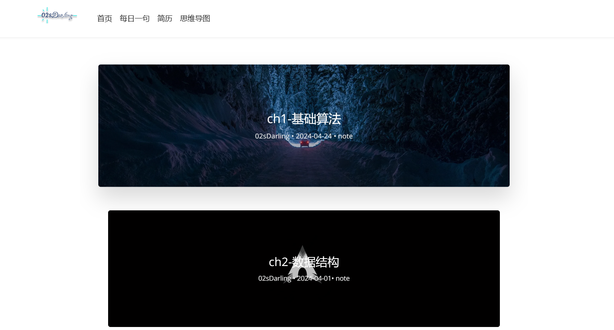
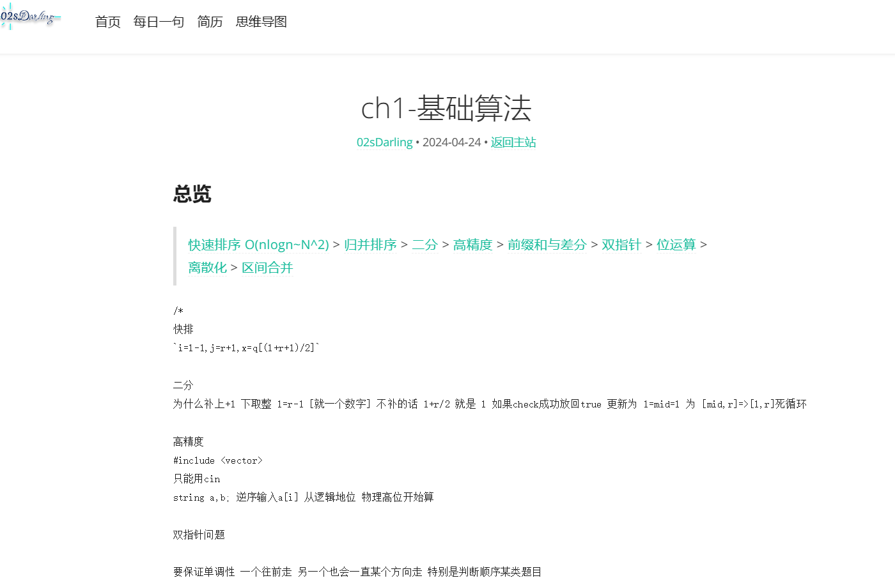
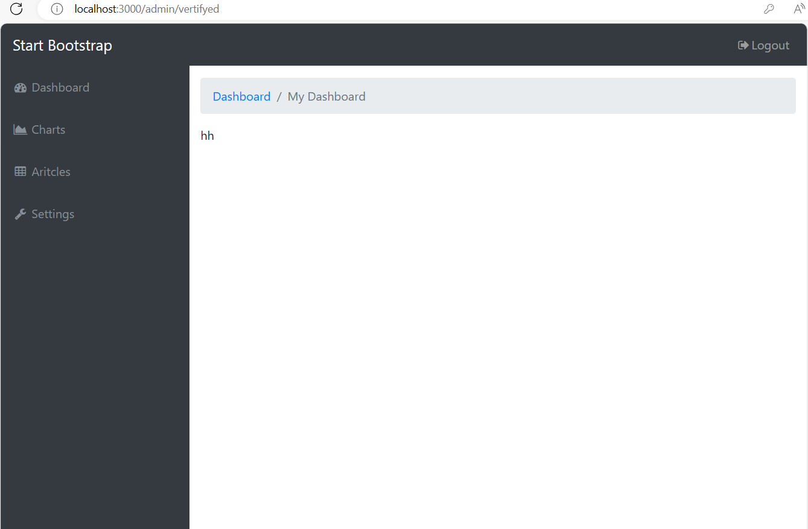

### 访问

项目已经部署，由于暂时没有使用Docker,现直接访问仍然为端口形式，域名由于服务器过期暂时不可用，因此SSL也没有心思去申请额外的OA证书了，望谅解。

首页**最新文章**将对现状进行一些补充

[首页](http://116.62.176.221:3000)

[Admin](http://116.62.176.221:3000/admin)

### 本地运行

1. 下载代码之后，使用`npm i` 安装项目，

2. 使用命令`node debug`非进程守护型进程，报错之后，可以查看出错信息，不会重新启动。
3. 使用命令`node start`启动守护进程，


### 页面展示

#### Day4-28

**vertifyed**


#### Day4-26
**index**


**article**


**day**


**admin(vertifyed)**


### 需求分析
```
/ 根目录 list 优化 每个标题 发布时间 做成mockdata
/article 
/resume pdf 
```

### 技术预研
rpc nodejs html TemplateEngine SSR


### Npm包
```
koa 
koa-mount
koa-static
nodemon 热更新工具
babel+react
koa-bodyparser 处理 POST
marked markdownToHtml
protocol-buffers 协议文件生成Buffer
```

<p style="text-align:right"> <span style="font-size: small; color: rgba(128, 128, 128, 0.5);">Edit by</span><em style="color: rgba(91, 255, 247, 0.65);">@02sDarling</em></p><p style="text-align:right"> <span style="font-size: small; color: rgba(128, 128, 128, 0.5);"><em>2024-04-27-18：17：36（星期六）</em></span></p>